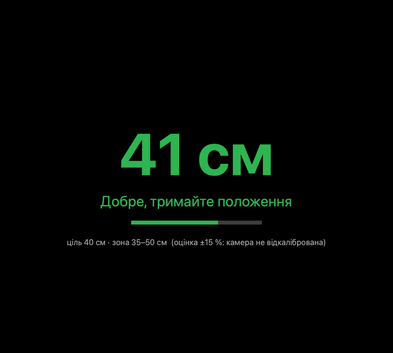
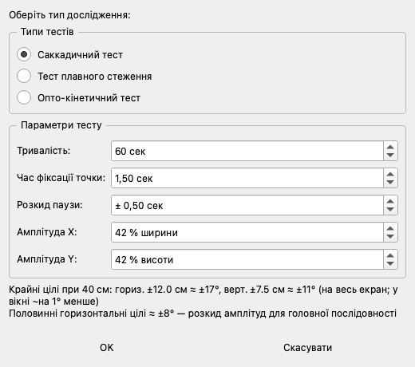
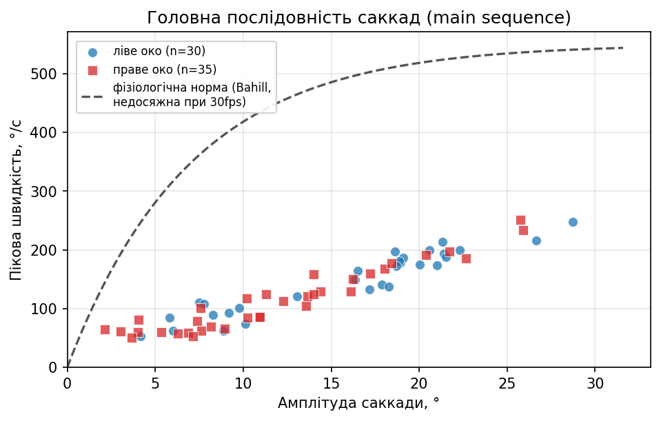
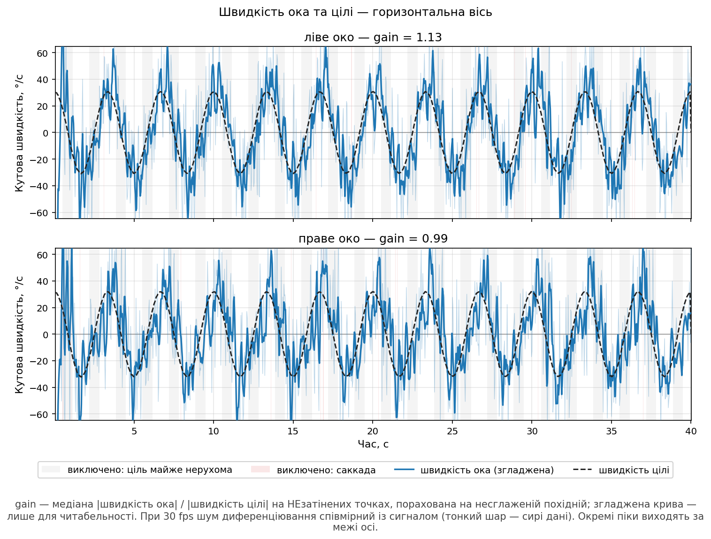
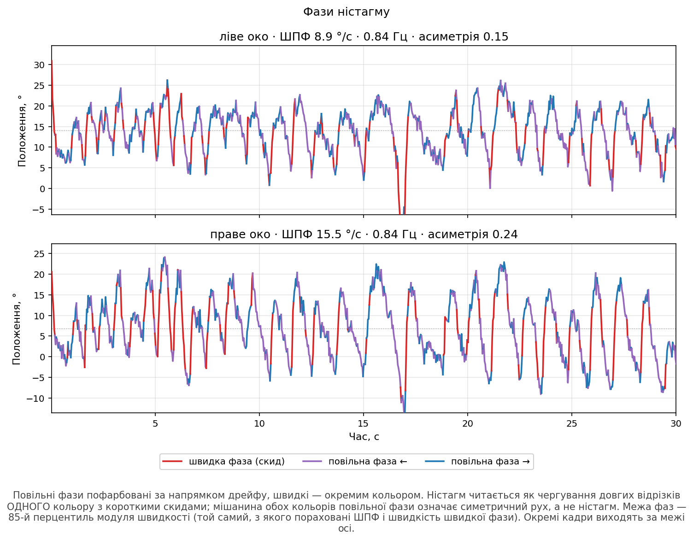

# Webcam VNG — videonystagmography on consumer hardware

A research prototype for **video-oculography (VNG) with an ordinary laptop webcam** —
no infrared cameras, no goggles, no chin rest. The goal is an accessible screening
tool for oculomotor and vestibular assessment that runs on hardware a clinic or a
patient already has.

> **This repository is a public project page.** The source code is private while the
> method is being validated. The project is under active development — see the
> [changelog](CHANGELOG.md) and [roadmap](#roadmap).

---

## Why

Clinical VNG systems are expensive, stationary and need trained staff. Most
dizziness and balance complaints are first seen in primary care, where no such
equipment exists. A webcam-based system can't replace a clinical VNG, but it can
**screen**: measure what consumer hardware *can* measure reliably, and say honestly
what it can't.

## What it does today

**Test battery** (standardised protocol, patient seated at 40 cm):

| Test | What is measured |
|---|---|
| Saccades (random targets, randomised timing) | latency, accuracy (primary saccade gain), amplitude, main sequence |
| Smooth pursuit (horizontal / vertical / 2-D patterns) | desaccaded velocity gain, correlation, phase lag, XY trajectory |
| Optokinetic nystagmus (4 directions) | slow-phase velocity, OKN gain, beat frequency, nystagmus phase segmentation |

**Measurement pipeline**

- Iris and eye-corner tracking with MediaPipe Face Mesh; head-translation-invariant eye vector.
- Two angular models: a **calibration-free anatomical model** (iris diameter → mm → degrees)
  and a **9-point per-visit calibration** covering the full stimulus range.
- Event detection with **I-VDT** and an adaptive, noise-relative velocity threshold.
- Live viewing-distance estimation from iris size; a **positioning step before every test**
  keeps the patient in the protocol zone.
- **Per-camera intrinsic calibration** from a printable checkerboard: a measured focal
  length replaces the geometric approximation, and it is stored with every recording.

**Honest quality control** — the system prefers "not measurable" to a plausible wrong number:

- tracking-loss vs. blink separation, usable-frame percentage, longest tracking gap;
- viewing-distance drift during the recording;
- measured (not nominal) frame rate and frame jitter;
- metrics that 30 fps cannot resolve (e.g. peak saccade velocity) are reported without
  norms and explicitly flagged.

**Clinical workflow**

- Patient → visit → examination records (SQLite), anonymised codes in all files.
- Preview before save; per-visit PDF report with charts, quality flags and method limitations.
- Every recording stores its **provenance**: code version, analysis-method version, camera,
  protocol version with any deviations, and the exact stimulus shown.

## Screenshots

*Interface and reports are currently in Ukrainian. All data shown are the developer's own
test recordings — no patient data.*

| | |
|---|---|
|    **Positioning step** — live distance from iris size; the test starts only after the patient holds the 37–43 cm zone. |    **Test setup** — protocol defaults with manual override and a live degrees preview. |
|    **Saccades** — main sequence against the physiological reference. |    **Smooth pursuit** — eye vs. target velocity; samples excluded from the gain are shaded. |
|    **Optokinetic nystagmus** — slow and fast phases segmented on the angular trace. | |

## Design principles

- **Reproducibility first.** Frozen numerical stack, golden-reference regression tests
  for the core algorithms, versioned analysis method and versioned normative data.
- **Honest quality flags** instead of silently degraded numbers.
- **One source of truth.** Every chart is drawn from exactly the series its number was
  computed from.
- **Provenance by default.** A recording describes the stimulus that was actually shown,
  not the operator's intent — including the presentation timing and the camera it was
  shot with. Re-analysis reads those, so a result is a function of the recording rather
  than of the settings that happen to be open.
- **Privacy.** Anonymised identifiers in files and reports; patient data never leave the
  local machine.

## Known limitations

- **30 fps webcams** cannot resolve peak saccade velocity or saccade duration; these are
  reported for reference only.
- No head fixation: head movement is compensated for translation, not yet for rotation.
- Vestibulo-ocular reflex testing is not supported.
- Absolute angular accuracy depends on the camera's focal length. Per-camera calibration
  is now available and strongly recommended; without it, distances carry a systematic error.
- **Not a medical device.** Research use only; not for clinical diagnosis.

## Roadmap

**Done**

- [x] Patient / visit / examination workflow and per-visit reports
- [x] Per-visit 9-point calibration; calibration-free anatomical model
- [x] Tracking-quality and viewing-distance control
- [x] Standardised test protocol (40 cm) with recorded provenance
- [x] Camera intrinsic calibration from a checkerboard
- [x] Settings for the measurement setup: camera, screen, calibration profiles
- [x] Single analysis path shared by preview, report and export, under a bit-exact
      regression baseline
- [x] Research dataset export — one method version per table
- [x] Reference-interval algorithm for device-specific norms

**Next**

- [ ] Optokinetic stimulus: parameter study for a monitor-sized field
- [ ] Clinical labelling of examinations — before data collection starts
- [ ] Structured clinical conclusion assembled from templates, physician-approved
- [ ] Pilot on healthy volunteers (test–retest), ruler check of the distance estimate
- [ ] Device-specific normative data from the first labelled cohort
- [ ] Stimulus defined in degrees, adapted to the measured viewing distance
- [ ] Interface design pass and English localisation
- [ ] Encrypted storage; ethics-committee documentation
- [ ] Packaging for distribution

## Research

Several methodological papers are in preparation (measurement limits of consumer
cameras, quality control in low-cost VOG, calibration strategies). Links will appear
here once published.

## Contact

Interested in collaboration, validation studies or clinical testing?
Please open an [issue](../../issues) in this repository.

---

© 2025–2026. All rights reserved. The images and text on this page may not be reused
without permission. The software itself is not publicly available at this stage.
